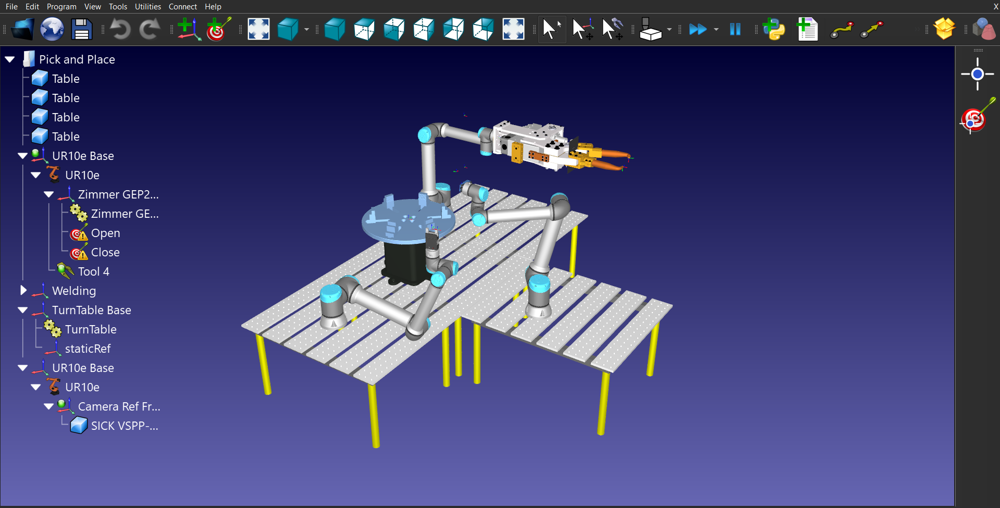
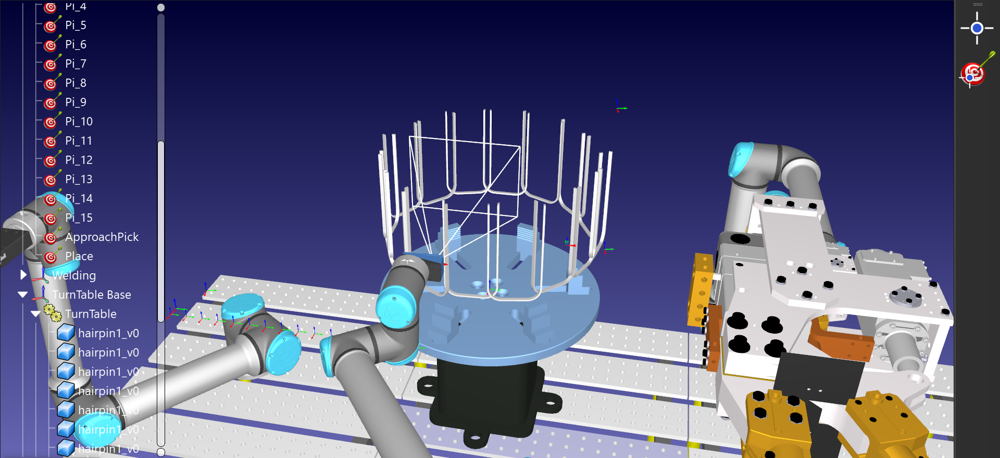
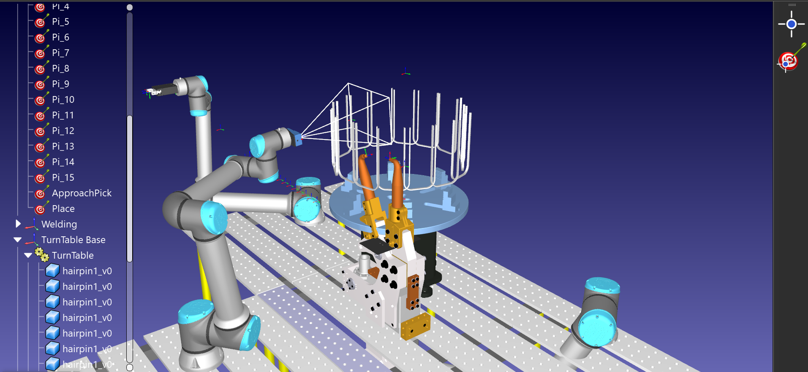

# Robodk
This is my first project both in terms of simulation software and robotics.

The project is on developing a Robotic cell for Pick_Place and Welding applicaitons using 'RoboDk' robot simulation software.

## Scene Setup
- **Components**:
  - 3 UR10 robots
  - U-shaped pins
  - A Camera
  - A Turntable

## Sequence:  
1. **Pick and Place**:
   - Robot1 picks the U pins and places them onto the Turntable.
   - The Turntable rotates 0.393 rad every time a new U pin is placed on it.
   - Once all the pins are placed, the Turntable rotates back to the home position.
2. **Welding**:
   - Robot2 starts welding each pin pair. For each welding movement, the Turntable rotates again by 0.393 rad.
   - The pins' overlap can be visualized through the camera mounted on Robot3.

## Code Explaination:
1. **Initialization**:
   - Define Robot1, base frame, tool, pins, and the Turntable (TT).
   - Define Robot1 joints_home and speed.
   - Define targets for Pick, approach, and Place.
  
2. **Pick and Place Operations**:
   - Spawn the pins in the scene and place them at each Pick target coordinate, with respect to the 'Part_Ref' reference frame.
   - Make Robot1 pick the pins by changing the parent of the pins to 'tool'.
   - During the place action, change the pins' parent back to the 'TT' frame.
   - Rotate the TT for every place action.
   - Once all the pins are placed on the TT, Robot1 moves to the home position, and the TT rotates back to home as well.
   
3. **Welding Operations**:
   - Define the weld frame, Robot2, and welding tool.
   - Set the weld target and approach position similarly to Robot1.

   
4. **Operation Execution**:
   - Robot2 performs the welding operations and moves back to the home position.
   - Delete all pick targets, pins, pins reference frame, and targets after completion.

Before running the code, the scene should be setup inside the RoboDk software.  

## Simulation
The complete simulation can be seen here: https://youtu.be/dYk3MkHwQvU
