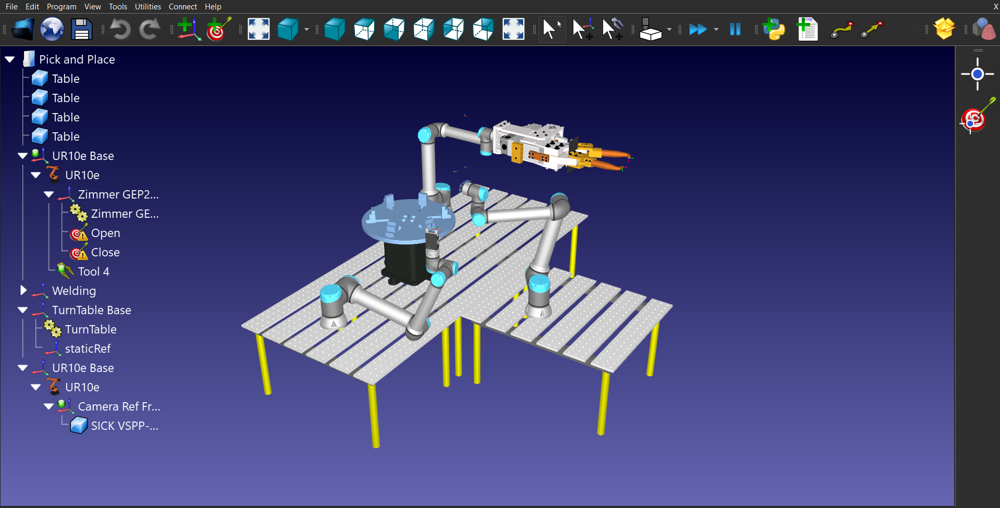
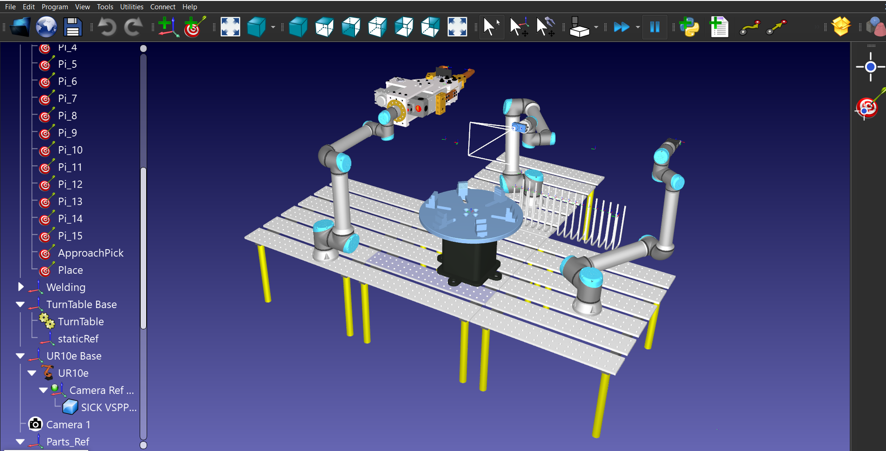
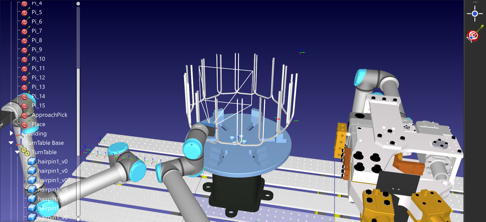
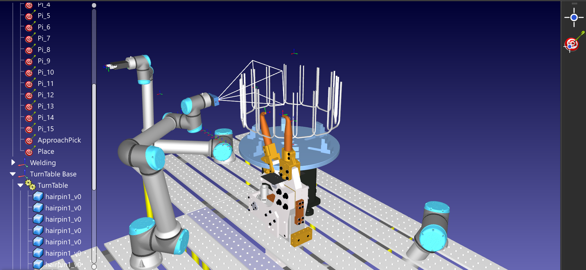

# RoboDK - Pick & Place and Welding Automation

This is my first project using both **robot simulation software and robotics**.

The project focuses on developing a **robotic cell** for **Pick & Place** and **Welding applications** using the **RoboDK** simulation software.

---

##  Scene Setup
### **Components Used:**
- **3 UR10 Robots**
- **U-shaped Pins**
- **A Camera**
- **A Turntable**

---

##  **Sequence of Operations**
### **1️ Pick and Place**
- **Robot1** picks the **U-shaped pins** and places them onto the **Turntable**.
- The **Turntable rotates** **0.393 radians** every time a new U-pin is placed.
- After all pins are placed, the **Turntable rotates back** to its **home position**.

### **2️ Welding**
- **Robot2** starts **welding** each **pin pair**.
- For each welding movement, the **Turntable rotates** again by **0.393 radians**.
- The **Camera mounted on Robot3** allows visualization of the **pins' overlap** during the welding process.

---

## 🖥️ **Code Explanation**
### **1️ Initialization**
- **Connect to RoboDK** and initialize the environment.
- Define:
  - **Robot1** (for Pick & Place).
  - **Robot2** (for Welding).
  - **Turntable (TT)**.
  - **Base frame and reference frames**.
  - **Tools** (gripper and welding tool).
  - **Camera settings**.
  - **Speed and home positions**.

---

### **2️ Pick and Place Operations**
- **Generate Pick Targets** dynamically using a loop.
- **Spawn the pins** in the scene at respective Pick target positions.
- **Robot1 picks the pins**:
  - **Attaches them to the gripper (tool)**.
- **Robot1 places the pins**:
  - **Releases them onto the Turntable (TT)**.
- **Turntable rotates** **after each placement**.
- Once all pins are placed:
  - **Robot1 moves to home position**.
  - **Turntable rotates back to home**.

---

### **3️ Welding Operations**
- Define **welding reference frame**.
- Set up:
  - **Robot2** (UR10e-Welding).
  - **Welding tool**.
  - **Welding positions (target and approach)**.
- **For each welding movement**:
  - **Turntable rotates**.
  - **Robot2 moves to the welding position**.
  - **Welding action is performed**.
  - **Robot2 moves back to approach position**.

---

### **4️ Operation Execution & Cleanup**
- **Robot2 completes welding** and moves to **home position**.
- **Cleanup Process:**
  - Remove all **Pick targets**.
  - Delete **pins and reference frames**.
  - Remove **welding targets** after execution.

---

##  **Prerequisites**
Before running the script, the **scene should be set up inside RoboDK**.

---

##  **Simulation Video**
The complete **simulation can be viewed here**:  
🔗 [Watch on YouTube](https://youtu.be/dYk3MkHwQvU)
